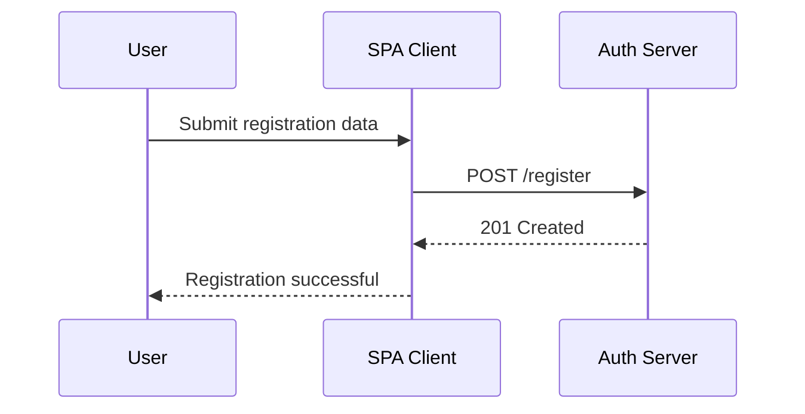
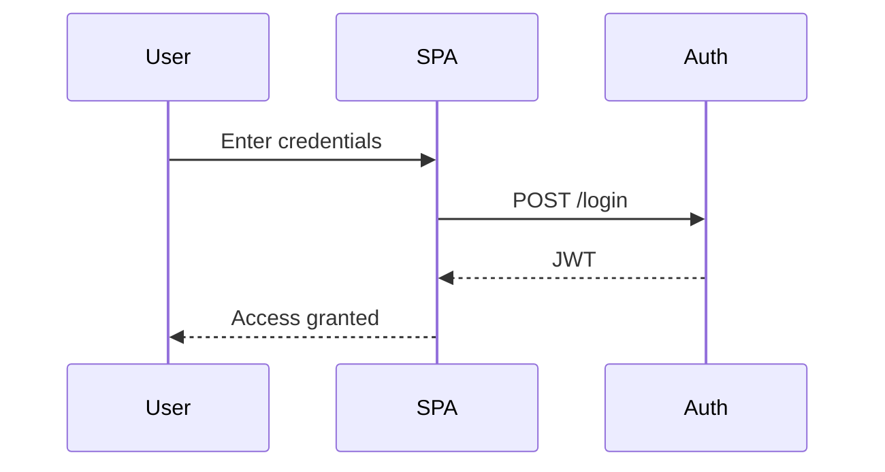
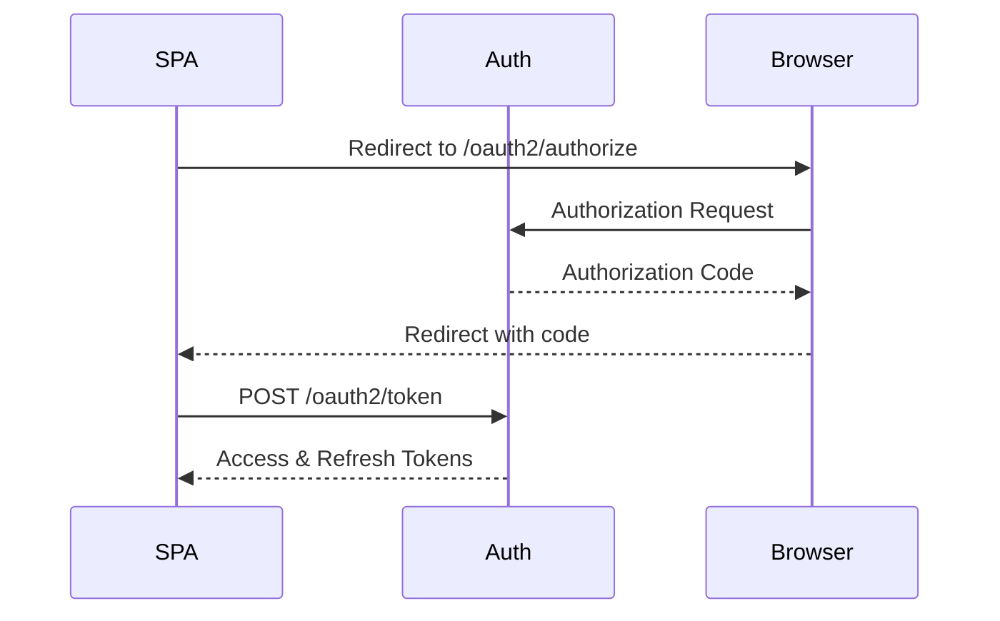
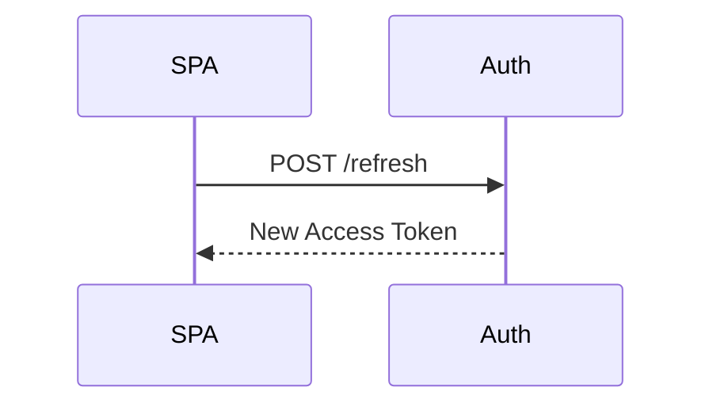

# Authentication Flows

## User Registration

```mermaid
sequenceDiagram
    participant User
    participant SPA as SPA Client
    participant Auth as Auth Server
    User->>SPA: Submit registration data
    SPA->>Auth: POST /register
    Auth-->>SPA: 201 Created
    SPA-->>User: Registration successful
```

## User Login

```mermaid
sequenceDiagram
    participant User
    participant SPA
    participant Auth
    User->>SPA: Enter credentials
    SPA->>Auth: POST /login
    Auth-->>SPA: JWT
    SPA-->>User: Access granted
```

## Authorization Code Grant (PKCE)

```mermaid
sequenceDiagram
    participant SPA
    participant Auth
    participant Browser
    SPA->>Browser: Redirect to /oauth2/authorize
    Browser->>Auth: Authorization Request
    Auth-->>Browser: Authorization Code
    Browser-->>SPA: Redirect with code
    SPA->>Auth: POST /oauth2/token
    Auth-->>SPA: Access & Refresh Tokens
```

## Refresh Token

```mermaid
sequenceDiagram
    participant SPA
    participant Auth
    SPA->>Auth: POST /refresh
    Auth-->>SPA: New Access Token
```

